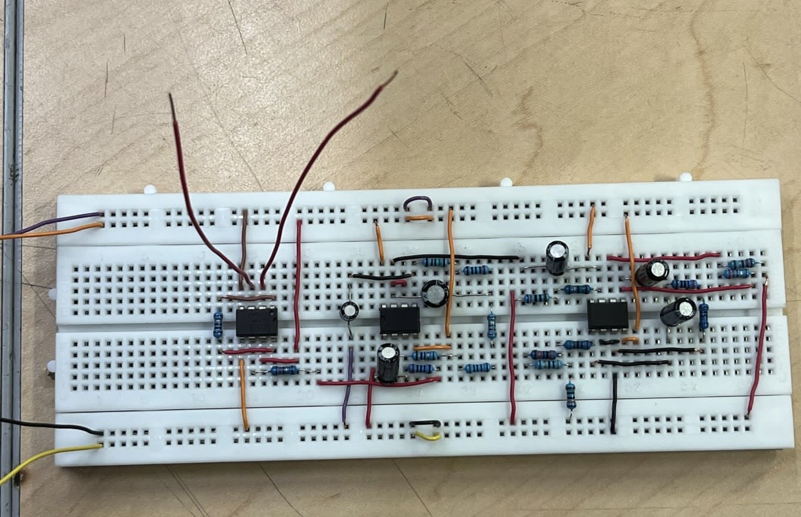
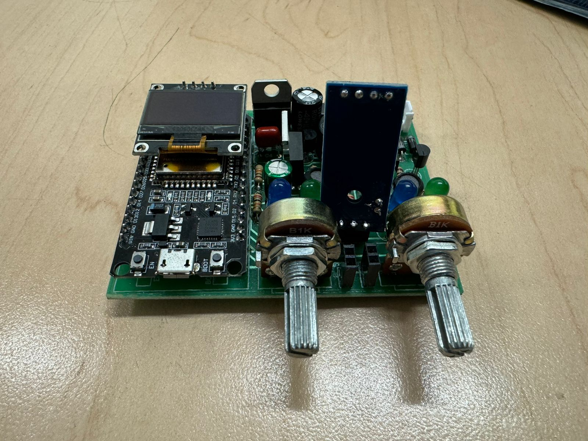
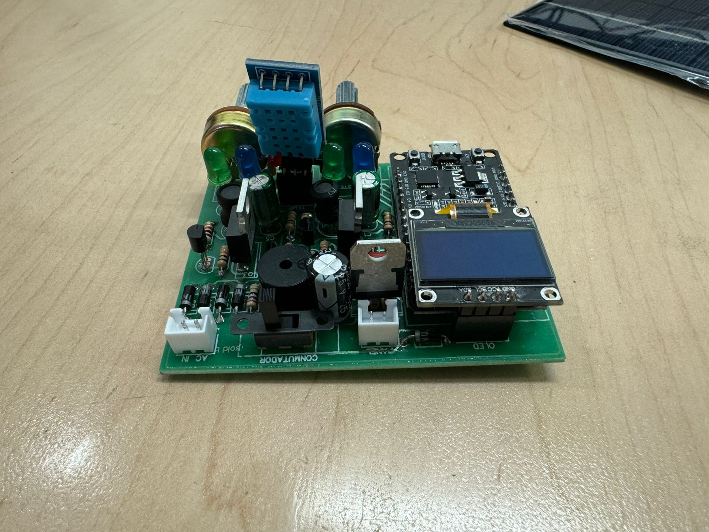

# Electrocardiogram Circuit
Using OPAMs and reading the signal output of an electrocardiogram, we have designed a circuit that can be used to measure the heart rate of a person.

# Batery Charger
We have designed a battery charger that can be used to charge a battery from a power source, also from a solar panel, by also displaying the charge level of the battery, having some safety features.

