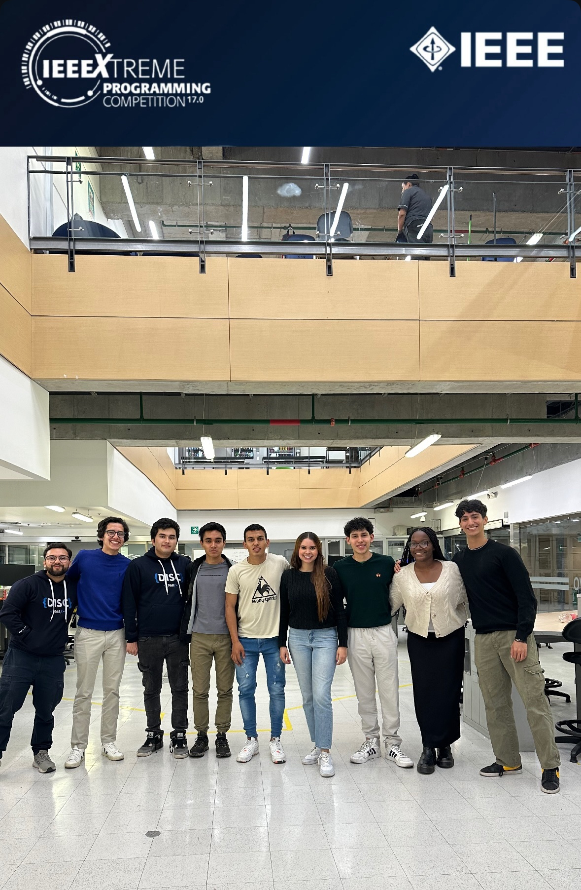
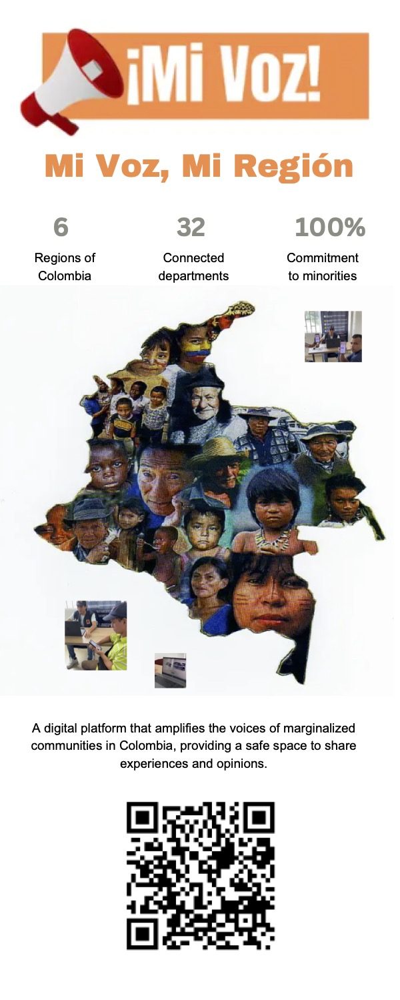

# Computer Society
Im a current memeber of the computer society branch of the Los Andes Unversity. Doing proyects over the semesters and also doing competitions.

# IEEEXTREAM
I have participated in the IEEE Xtream 2024 competition landing on top 10 of my country.

# Mi voz mi region
In the team i also participated making the web page of the proyect mi voz mi region, in which we try to help minorities by giving them a voice that could be heard by ONGs and other organizations.

